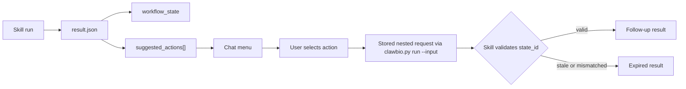

# Skill Action Contract

ClawBio skills usually end by writing a report. The structured action contract
lets a skill also say what can sensibly happen next.

The contract is intentionally small. A skill writes optional fields into
`result.json`; the ClawBio runner promotes those fields; the Telegram and
Discord adapters render concise chat output and, when the user selects an
offered action, dispatch only the stored structured request back through the
normal `clawbio.py run --input ...` path.

The bridge between disk and chat is `_promote_structured_result_fields` in
`clawbio.py`, which attaches these fields to the runner result so adapters can
read them without re-parsing `result.json`.

This is not a workflow database and not hidden process memory. It is a
serialized handoff between a skill, ClawBio, and a chat adapter.

See also `docs/skill-intents.md` for declarative routing of free-form user
prose into a skill. Skill intents help decide what to run; this contract
describes what a skill can offer after it has run.

## What This Is Not

This contract deliberately avoids becoming a general workflow engine.

It is not:

- a database of global workflow sessions,
- a per-user or per-channel state store,
- hidden process memory for a skill,
- an adapter-owned resource cache,
- a scheduler for long-running jobs,
- a heartbeat or polling mechanism,
- a natural-language planner,
- a permission system,
- a way to execute shell snippets suggested by a skill,
- a replacement for a skill's own validation logic.

The adapter stores a pending action bundle briefly so a user can select one of
the offered choices. The skill owns its domain state, resources, validation,
and durable caches. ClawBio only moves structured requests and structured
results between them.

A `waiting` state does not become `ready` on its own. The user, or a future
scheduled job outside this contract, must re-invoke the skill.

## Result Fields

The chat-facing fields currently understood by the runner and adapters are:

| Field                 | Purpose                                              |
|-----------------------|------------------------------------------------------|
| `chat_summary_lines`  | Short skill-authored lines to show in chat.          |
| `preferred_artifacts` | Output files the UI should surface first.            |
| `workflow_state`      | Optional state identity and lifecycle metadata.      |
| `suggested_actions`   | Stored follow-up actions the user may choose.        |
| `report_md`           | Full markdown report text embedded in `result.json`. |

These fields are additive. A skill can continue to emit only a normal report,
or only `suggested_actions`, and older action payloads remain valid.

## Three Layers

The contract separates three ideas that are easy to confuse:

1. **Lifecycle state**

   `workflow_state.lifecycle` is a small cross-skill UI vocabulary. It tells
   adapters how to present the state, not how to run biology.

   Think of it like the signal you receive when making a phone call: `busy`,
   ringing, disconnected. It tells you whether to try, wait, or give up,
   without telling you who you are calling.

2. **Workflow or analysis state**

   `workflow_state.state_schema`, `state_id`, and `state_label` identify the
   skill-specific analysis snapshot. The skill defines what those fields mean
   and validates incoming requests against them.

   Think of pausing an analysis at your desktop when colleagues collect you
   for lunch: you tell them where you are, in enough detail that they could
   continue the analysis without guessing. You do not repeat the raw data;
   just as in real life, you point to the resources that matter.

3. **Actions and resources**

   `suggested_actions` describe what the user can do next from the current
   state. `preferred_artifacts` describe what outputs are worth inspecting.

   This is the most concrete layer, but often the richest. In its simplest
   form, it can resemble a table of contents for a help file. A more
   sophisticated skill may inspect the findings and, depending on the number
   of samples or the data distribution, offer different eligible statistical
   tests.

In other words:

```text
workflow_state.lifecycle      -> generic UI condition
workflow_state.state_id       -> skill-specific snapshot identity
suggested_actions[]           -> valid transitions or follow-up views
preferred_artifacts[]         -> useful resources from this state
```

Examples:

| Scenario                                        | Lifecycle state | Workflow or analysis state                                                                                                                  | Actions and resources                                                                        |
|-------------------------------------------------|-----------------|---------------------------------------------------------------------------------------------------------------------------------------------|----------------------------------------------------------------------------------------------|
| Affinity proteomics demo completed              | `ready`         | `state_label: "differential-abundance-ready"` and a SHA-256 `state_id` over the compact result payload                                      | `Top Proteins`, `Volcano Summary`, `report.md`, `tables/diff_abundance.tsv`, figures         |
| Affinity proteomics stale request               | `expired`       | `state_label: "stale-action-request"` with a message explaining the mismatch                                                                | No new actions; chat summary asks the user to rerun and choose a fresh action                |
| Long-running local resource preparation         | `waiting`       | `state_label: "resource-preparation-pending"` with a skill-defined resource identifier                                                      | `Check Status`, `Cancel`, or a log artifact if the skill emits them                          |
| Reference genome already downloaded and indexed | `ready`         | `state_label: "reference-genome-ready"` with a `state_id` or resource id derived from the genome build, index path, and manifest/checksum   | `Run Alignment`, `Annotate Variants`, `Rebuild Index`, plus a resource manifest artifact     |
| Interactive sequence-design skill               | `ready`         | `state_label: "construct-loaded"` with a `state_id` for the loaded construct and selected features                                          | `Find Restriction Sites`, `Design Primers`, `Simulate Assembly`, plus map or table artifacts |

## Workflow State

`workflow_state` is a sibling of `suggested_actions` in `result.json`.

```json
{
  "workflow_state": {
    "state_schema": "example_skill.workflow_state.v1",
    "state_id": "sha256:...",
    "lifecycle": "ready",
    "state_label": "analysis-ready",
    "description": "The requested analysis results are available.",
    "message": "Optional situational text for this result."
  }
}
```

Field meanings:

| Field          | Meaning                                                                 |
|----------------|-------------------------------------------------------------------------|
| `state_schema` | String identifier for the skill's state shape. This is not JSON Schema. |
| `state_id`     | Skill-defined identity for whatever the skill considers current state: an analysis snapshot, resource manifest, session id, or another value the skill can validate later. |
| `lifecycle`    | Optional common lifecycle value.                                        |
| `state_label`  | Short human-readable label for the state.                               |
| `description`  | Usually stable explanation of what the state represents.                |
| `message`      | Optional situational explanation, for example a stale-request message.  |

The skill chooses how to compute `state_id`. Common choices include a content
hash over relevant inputs/results, a hash over a compact state payload, or a
run-generated identifier when the skill has its own durable state store.

The important rule is that the skill must be able to explain when a stored
action should still be accepted and when it should be rejected.

## Lifecycle Values

`workflow_state.lifecycle` is optional. Omitting it is equivalent to `ready`,
but adapters should not render a lifecycle header when the field is absent.

| Value       | Meaning                                                                                                        |
|-------------|----------------------------------------------------------------------------------------------------------------|
| `ready`     | Actions can be selected now.                                                                                   |
| `busy`      | The skill is doing in-process work, or the represented state is not ready because the skill is computing.      |
| `waiting`   | The skill is blocked on user input, confirmation, files, an external/local resource, or an out-of-process job. |
| `disabled`  | Actions are intentionally unavailable.                                                                         |
| `error`     | The state exists but follow-up actions are blocked by an actual failure; use `expired` instead for stale-state rejection. |
| `expired`   | The state or offer is no longer valid, including stale-state rejection.                                        |

The skill's emitted lifecycle is authoritative. ClawBio and the adapters do not
invent lifecycle transitions on the skill's behalf.

For `ready`, `busy`, and `waiting`, adapters may offer any emitted actions
normally. For `disabled`, `error`, and `expired`, adapters should not offer
selectable actions unless the skill explicitly emits actions anyway.

When a lifecycle header is rendered, the current chat format is:

```text
State: ready — analysis-ready
```

If `state_label` is absent:

```text
State: ready
```

## Suggested Actions

Each action must contain a stable `action_id`, a human `label`, and a structured
nested `request`. Shell-only or prose-only suggestions are ignored by the chat
adapters.

```json
{
  "suggested_actions": [
    {
      "action_id": "show-top-results",
      "label": "Top Results",
      "description": "Render a compact table of the highest-ranked results.",
      "estimate": "~5s",
      "request": {
        "schema": "example_skill.action_request.v1",
        "action": "top-results",
        "state_schema": "example_skill.workflow_state.v1",
        "state_id": "sha256:...",
        "n": 5,
        "rows": []
      },
      "requires_confirmation": false,
      "expected_artifacts": ["report.md"],
      "timeout_secs": 30
    }
  ]
}
```

`rows` is only a placeholder in this generic example. Each skill chooses field
names that fit its domain, such as `proteins`, `variants`, `features`, or
`primers`.

Action field meanings:

| Field | Meaning |
|-------|---------|
| `action_id` | Stable id used for matching and auditing. |
| `label` | Short user-facing menu label. |
| `description` | Optional explanation for richer future UIs; current chat adapters do not render it. |
| `estimate` | Optional string rendered verbatim as the action suffix. |
| `request` | Stored structured payload dispatched back through `clawbio.py run --input`. |
| `requires_confirmation` | Whether a selected action needs explicit confirmation before execution. |
| `expected_artifacts` | Output files the action is expected to produce or refresh. |
| `timeout_secs` | Optional per-action timeout for the runner path. |

The nested `request` is the safety boundary. When the user chooses an action,
the adapter writes this stored request to a temporary JSON file and dispatches
it through the normal ClawBio runner. The adapter does not execute `shell_line`
from a suggested action.

`estimate` is an optional string. If present, the adapter renders it verbatim
as the action suffix:

```text
1. Top Results (~5s)
```

If no `estimate` is present and `requires_confirmation` is `false`, the legacy
suffix remains:

```text
1. Top Results (safe refresh)
```

## Receiving an Action Request

Skills that emit executable actions should also detect those action requests on
input. The usual pattern is to check whether `--input` points to an action JSON
file before running the full pipeline, then dispatch to a small follow-up
handler:

```python
if args.input:
    request = load_action_request(Path(args.input))
    if request is not None:
        handle_action_request(request, output_dir)
        return
```

The follow-up handler should validate the request, write `report.md` and
`result.json`, and exit through the normal success path.

## Reentrancy

Workflow states are reentrant snapshots, not persisted sessions.

A skill can re-enter a state from the structured action request it emitted if
that request carries enough compact state data, artifact references, or durable
identifiers. The `affinity-proteomics` example carries the compact result rows
needed for read-only follow-ups, so its follow-up handler can validate and
render without hidden process memory.

ClawBio does not maintain a global latest state, does not resume a running
process, and does not decide whether an independent newer run supersedes an old
offer. Skills that need durable session semantics can build that on top of this
contract later.

## Skill-Level Resources

Some states describe a user's current analysis. Others describe a skill-wide
local resource that changes what the skill can do, such as a reference genome
that has already been downloaded and indexed.

Those resources should live in the skill's own durable storage, cache, or
manifest, not in the chat adapter. The action contract can point to them:

- `workflow_state` can report that the resource is `ready`, `waiting`,
  `expired`, or `error`.
- `state_label` can name the resource state, for example
  `reference-genome-ready` or `genome-index-missing`.
- `state_id` can be derived from a resource manifest: genome build, source URL,
  local index path, index parameters, and checksums.
- `preferred_artifacts` can point to the manifest or log files.
- `suggested_actions` can offer resource-aware next steps such as `Run
  Alignment`, `Annotate Variants`, `Download Genome`, `Build Index`, `Check
  Status`, or `Rebuild Index`.

This keeps the persistent resource state with the skill that owns it while
still allowing the adapter to present the state and offer safe next actions.

Resources may be shared across chats. If one chat selects `Rebuild Index`, the
skill should update the resource manifest and therefore its `state_id`; pending
offers in other chats that still reference the old `state_id` should be
rejected as `expired` on their next selection.

## Unresolved or Ambiguous Inputs

When a skill receives input it cannot resolve, such as a typo, ambiguous genome
build, or missing reference, model it as a `waiting` state offering likely
corrections rather than as an error:

```json
{
  "workflow_state": {
    "lifecycle": "waiting",
    "state_label": "genome-query-unresolved",
    "message": "I could not resolve the requested genome build to a supported build."
  },
  "suggested_actions": [
    {"action_id": "use-hg38", "label": "Use hg38", "request": {"schema": "example.action_request.v1", "action": "use-genome", "genome": "hg38"}},
    {"action_id": "use-hg19", "label": "Use hg19", "request": {"schema": "example.action_request.v1", "action": "use-genome", "genome": "hg19"}},
    {"action_id": "show-supported-genomes", "label": "Show supported genomes", "request": {"schema": "example.action_request.v1", "action": "show-supported-genomes"}}
  ]
}
```

This keeps the user in a guided loop instead of dropping them into a free-text
clarification round. No `unknown` lifecycle value is needed; `waiting` plus a
precise `state_label`, `message`, and correction actions carry the meaning.
Actions emitted from an unresolved `waiting` state may have no analysis state
to validate against yet. They establish the initial state when selected, so
they do not need to carry a `state_id`.

## Stale Requests

The skill validates state-aware action requests. If validation fails, the skill
should return a normal successful result rather than crashing:

```json
{
  "schema": "example_skill.action_result.v1",
  "workflow_state": {
    "state_schema": "example_skill.workflow_state.v1",
    "state_id": "sha256:...",
    "lifecycle": "expired",
    "state_label": "stale-action-request",
    "message": "This follow-up action no longer matches the state that produced it."
  },
  "chat_summary_lines": [
    "This follow-up action is stale or mismatched. Please rerun the analysis and choose a fresh action."
  ]
}
```

The process should exit `0`. The chat adapters render this through the existing
success path. No special rejection UI is required.

Do not quote unsanitised user input through `chat_summary_lines` or
`workflow_state.message`; both are shown verbatim to the chat.

## Reference Implementation

For a concrete implementation, see:

- `skills/affinity-proteomics/affinity_proteomics.py` for state computation,
  action request generation, and stale-request handling.
- `skills/affinity-proteomics/SKILL.md` for the skill-level documentation
  pattern, including how `state_id` is derived.
- `skills/affinity-proteomics/tests/test_affinity_proteomics.py` for emission,
  valid-action, and stale-rejection tests.
- `tests/test_action_offers.py` and `tests/test_clawbio_runner_actions.py` for
  rendering and runner-promotion tests.

## Chat Scope

Pending actions remain scoped exactly as they were before this contract:

| Adapter                          | Pending action scope |
|----------------------------------|----------------------|
| Telegram (`roboterri.py`)        | `chat_id`            |
| Discord (`roboterri_discord.py`) | `channel_id`         |

That means two different Telegram chats, or two different Discord channels, do
not share pending action bundles.

## Known Limitations

In a shared Discord channel, two concurrent users may overwrite each other's
pending action bundle. Per-user workflow sessions are out of scope for this
contract.

## Flow



## Authoring Checklist

When adding stateful actions to a skill:

1. Emit `workflow_state` only when it helps explain the current analysis state.
2. Keep `lifecycle` generic and small; put skill-specific meaning in
   `state_schema`, `state_id`, and `state_label`.
3. Each action's nested `request` must carry the `state_id` it expects and
   enough data, artifact references, or durable identifiers for the skill to
   validate it later without consulting hidden memory.
4. Do not rely on chat adapter memory for skill-specific validation.
5. Reject stale or mismatched requests with `lifecycle: "expired"` and useful
   `chat_summary_lines`.
6. Document the `state_id` derivation in the skill's `SKILL.md`.
7. Add focused tests for rendering, runner promotion, valid action handling,
   and stale rejection.
8. Add a dispatch branch in the skill's `main()` that detects an action-request
   JSON via `--input` and routes to a follow-up handler before the normal
   pipeline.

## What This Makes Possible

A first use of this contract may be deliberately modest: a completed analysis can
offer a small menu of read-only follow-up cards. That is already useful because
it turns a static report into a guided local conversation without allowing
free-form commands to leak into execution.

The larger opportunity is that a ClawBio skill can become a navigable local
instrument. A skill can expose what state it is in, what artifacts are available
from that state, what transitions are valid, and what a follow-up is expected
to cost. The chat adapter can stay simple while the skill becomes more
expressive.

For affinity proteomics, that could grow from "show top proteins" into a guided
analysis console: explain one protein, compare thresholds, inspect PCA support,
rerun with a stricter FDR, or open the artifacts that justify a claim. The user
could move between summary, evidence, plots, and parameterized reruns while the
skill keeps the state identity and validation rules local.

The adapter does not aim to replace expert tools, and does not let the bot
improvise uncontrolled commands. It gives local tools a common way to present
their next safe moves. It turns ClawBio from "run a skill and read a report"
into "enter a skill, inspect where you are, and choose the next valid step."

## References

- PR #240 — initial `suggested_actions` contract.
- PR #251 — `workflow_state`, lifecycle vocabulary, and stale-request handling.
